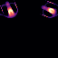

RiveSunder here. I'm a human person interested in exploring and respecting this and other possible universes. Currently I work as a postdoc working on evolutionary algorithms and complexity. Previously I worked on machine learning for computational drug design, and before that I worked on inverse problem solving for microscopy.

---

[Publications](papers.md)

[Projects](portfolio.md)

---

 
 

### Current Pursuits
 
* A lot of my attention has recently gone to [Your Universal Cellular Automata](https://github.com/rivesunder/yuca), a continuous cellular automata research library. This library has been used to power a few peer-reviewed publications, links to the pre-prints and supporting resources are consolidated at [https://rivesunder.github.io/yuca](https://rivesunder.github.io/yuca). I'm also working on a few other projects on evolutionary/developmental algorithms and simulating soft robotics.

<!--- * After something of a hiatus, I plan to update [Bootstrapping Deep Neuroevolution and Developmental Learning](https://github.com/rivesunder/bevodevo) over the next year or so. `bevodevo` is a resource for studying and experimenting with a range of evolutionary and developmental algorithms, currently with an emphasis on episodic reinforcement learning tasks but I hope to include ideas from open-endedness soon. 

* **[OpenSafety](https://github.com/rivesunder/opensafety)** Although DeepMind's acquisition and open-source plans for the [MuJoCo](https://deepmind.com/blog/announcements/mujoco) physics simulator has made my original motivation for building [OpenSafety](https://github.com/rivesunder/opensafety) irrelevant, there is still plenty to explore in the world of constrained RL and the control problem. I plan to use the library to explore the reward hypothesis (aka the reinforcement learning hypothesis) and to add additional tasks with an eye toward soft robotics and sim2real. --->

 <!---->
 
 

<!--
### Previous Projects

* **Carle's Game** was part of the [2021 IEEE Conference on Games](https://ieee-cog.org/2021/index.html#competitions_section) as a fairly unsuccessful competition with 0 entries. The project yielded a [proceedings paper](https://ieee-cog.org/2021/assets/papers/paper_329.pdf), a [Life-like cellular automata library](https://github.com/rivesunder/carles_game), a [t-shirt](https://rivesunder.threadless.com/designs/puffer-progression), and [several](https://ieee-cog.org/2021/assets/papers/paper_329.pdf) example/baseline [submissions](https://github.com/rivesunder/moving_in_morley). While I likely won't do the contest again due to the low turnout, if I do I will incorporate a broader swath of grid-based cellular automata, including [Lenia](https://arxiv.org/abs/1812.05433) and [Expanded Universe](https://arxiv.org/abs/2005.03742), and [SmoothLife](https://arxiv.org/abs/1111.1567v2), particularly discovering and exploring new artificial ecologies and taxonomies.

* [DockRL](https://github.com/rivesunder/dockrl). Molecular docking wrapped in a reinforcement learning environment with optimization of the protein-ligand re-docking problem via covariant matrix adaptation evolution strategies. 

* [Policy Generating Evolved Networks](https://github.com/rivesunder/pgens). An approach to neuroevolution that evolves a meta-policy defining a distribution of policies for solving RL problems. Think evolved GANs for generating a diverse spectrum of policies based on fitness in a given RL environment.

### Writing 

* [theScinder](https://thescinder.com) ([Medium version](https://medium.com/the-scinder)). Essays of general interest on topics related to the practice and produce of science. Following feedback, I've been doing my best to make the articles on this blog more approachable and interesting for all levels of technical ability. I used to also describe my machine learning projects here, but I've since moved technical write-ups to a dedicated blog.
* [RiveSunder Blog](https://rivesunder.gitlab.io). Writeups for some of my projects in machine learning. 
* [SortaSota](https://medium.com/sorta-sota). A blog where I try to explain things as simply as possible, but no simpler, mainly in tutorial format. In part I started this blog to give myself permission to teach skills and write about ML topics that are not necessarily at the cutting edge. It's state of _an_ art, just not state of _the_ art. 
-->

* here, on GitHub
* on Twitter: [@rivesunder](https://twitter.com/rivesunder)

 
<em>Futurologists discussing AI safety rarely considered the possibility of the Pikagoo doomsday scenario.</em>

<!--
Leaving the emojis here for now.
- 🔭 I’m currently working on ...
- 🌱 I’m currently learning ...
- 👯 I’m looking to collaborate on ...
- 🤔 I’m looking for help with ...
- 💬 Ask me about ...
- 📫 How to reach me: ...
- 😄 Pronouns: ...
- ⚡ Fun fact: ...
-->
