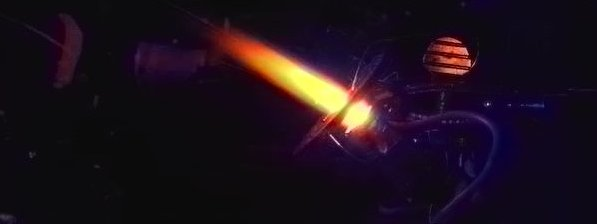

RiveSunder here. I'm an interdisciplinary scientist broadly interested in exploring what it means to be an intelligent agent in the universe. I've worked largely in inverse problem solving and deep learning for optical microscopy in recent years. Currently I'm studying evolutionary and developmental algorithms as a path to intelligence, and in particular I am interested in issues of safety and meta-learning. 

<!--
Some things I've worked on:

* Humanized yeast with human ATP synthase, intended for high throughput screening of rare mitochondrial disease drug candidates.
* Fed attenuated _Salmonella_ and lab-standard _Escherichia coli_ to _Acanthamoeba castellanii_ to determine that, yep, soil amoebae don't like to eat nasty pathogens either.
* Picked up and pulled on individual kinesin proteins, using light for fingers.
* Used defocus and chromatic aberration in ordinary microscopes to distill clear images of the transparent skeletal elements of cells (microtubules), ~4,000 times thinner than a human hair, from single noisy images. I also used interference in reflected light to the same end. 
-->

---

### Projects I've been working on recently
* [Bootstrapping Deep Neuroevolution and Developmental Learning](https://github.com/rivesunder/bevodevo). `bevodevo` is a resource for studying and experimenting with a range of evolutionary and developmental algorithms, currently with an emphasis on episodic reinforcement learning tasks but I hope to include ideas from open-endedness soon. 
* [Differentiable Cellular Automata](https://github.com/rivesunder/dca). `dca` is a project where I explore the confluence of ideas from differentiable programming, neural networks, and cellular automata, along the lines of Distill's thread on [Differentiable Self-Organizing Systems](https://distill.pub/2020/selforg/). 
* [DockRL](https://github.com/rivesunder/dockrl). Molecular docking wrapped in a reinforcement learning environment with optimization of the protein-ligand re-docking problem with covariant matrix adaptation evolution strategies. 
* [Policy Generating Evolved Networks](https://github.com/rivesunder/pgens). An approach to neuroevolution that evolves a meta-policy defining a distribution of policies for solving RL problems. Think evolved GANs for generating a diverse spectrum of policies based on fitness in a given RL environment.
 
### Writing 

<strong><!-- In addition to some commissioned writing assignments you may occasionally read on publications like Towards Data Science or KDNuggets, -->I have a few personal blogging projects:</strong>

* [theScinder](https://thescinder.com) ([Medium version](https://medium.com/the-scinder)). Essays of general interest on topics related to the practice and produce of science. Following feedback, I've been doing my best to make the articles on this blog more approachable and interesting for all levels of technical ability. I used to also describe my machine learning projects here, but I've since moved technical writeups to a dedicated blog.
* [RiveSunder Blog](https://rivesunder.gitlab.io). Writeups for some of my projects in machine learning. 
* [SortaSota](https://medium.com/sorta-sota). A blog where I try to explain things as simply as possible, but no simpler, mainly in tutorial format. In part I started this blog to give myself permission to teach skills and write about ML topics that are not necessarily novel. It's state of _an_ art, just not state of _the_ art. 

### Contact

The best way to get in touch with me is probably via email. I use Protonmail and you can guess my address from my GitHub username. You can also find me 

* on Twitter: [@rivsesunder](https://twitter.com/rivesunder)

 
<em>Futurologists discussing AI safety rarely considered the possibility of the Pikagoo doomsday scenario.</em>

<!--
Leaving the emojis here for now.
- 🔭 I’m currently working on ...
- 🌱 I’m currently learning ...
- 👯 I’m looking to collaborate on ...
- 🤔 I’m looking for help with ...
- 💬 Ask me about ...
- 📫 How to reach me: ...
- 😄 Pronouns: ...
- ⚡ Fun fact: ...
-->
